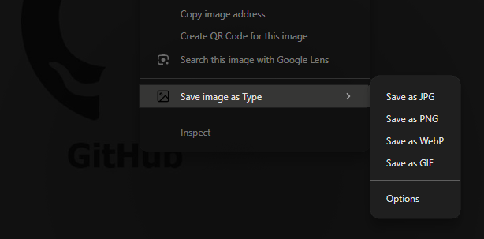
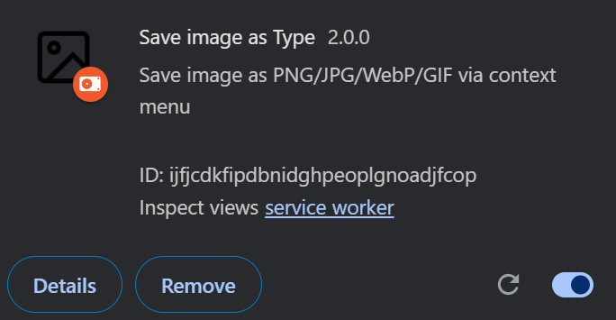

# *Save Image as Type* v2
Fork of [src](https://github.com/image4tools/Save-Image-as-Type) (*authored by image4tools which has since been removed*), but with **no hidden, shady functionality**. Also adds a **GIF** support and extension options.
## About

Tired of having saved images as *.webp* type? ***Save Image as Type v2*** is a chrome extension which adds an option "*Save as PNG/JPG/WebP/GIF*" to context menu on right-clicking any image.

> The original extension was based on *Save Image As Type 1.0.5* which has not been maintained for a long time and is no longer accessible.

## Installation
1. Go to [`chrome://extensions/`](chrome://extensions/)
2. Enable `Developer mode` (upper right corner)
3. Select `Load unpacked` in the upper left corner and select the extracted extension folder.  
The extension should be installed successfully.  

## Acknowledgments
- Rob Wu: https://github.com/Rob--W
- Cuixiping: https://github.com/cuixiping
- jnordberg: https://github.com/jnordberg/gif.js
